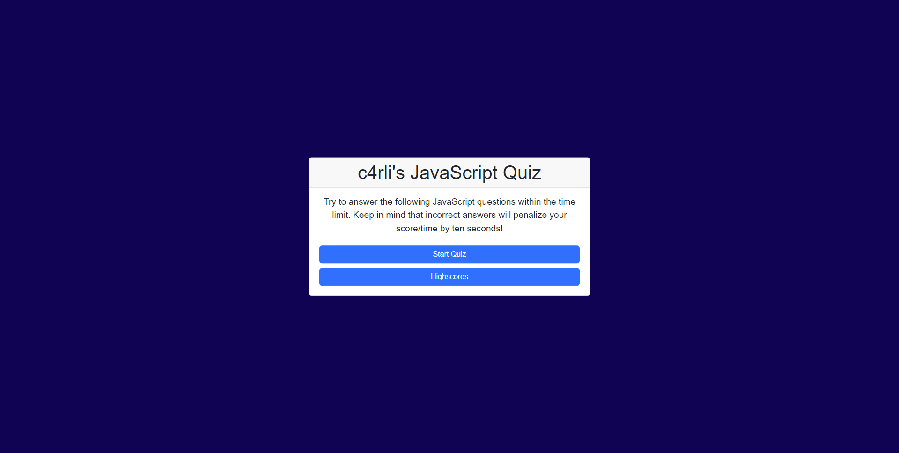
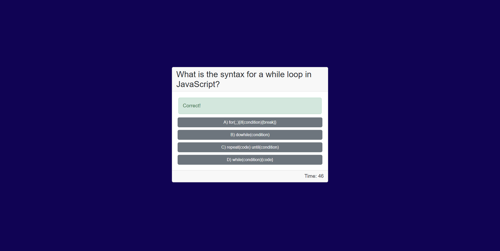
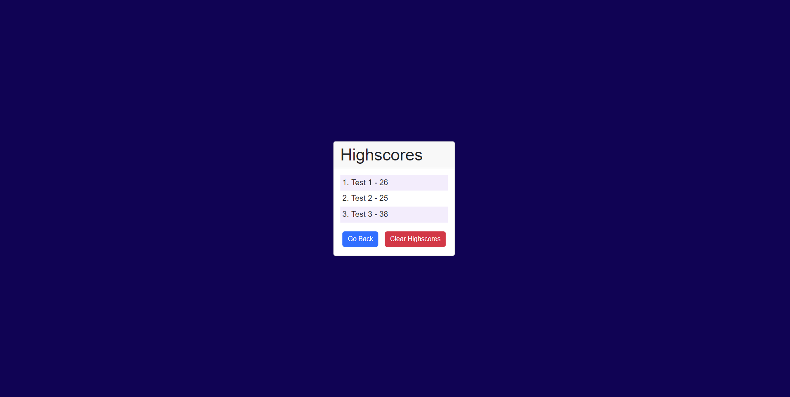

# JavaScript Quiz Webapp
Graphical quiz based on JavaScript syntax questions built with Bootstrap 5, CSS and JavaScript. 

## Description
This repo contains source code for a quiz webpage that asks the user 10 questions on the topic of JavaScript syntax. 
The page has a timer keeping track of score and a highscores page that saves locally.
Link to deployed webpage can be found below.

### My User Story:
```
GIVEN I am taking a code quiz
WHEN I click the start button
THEN a timer starts and I am presented with a question
WHEN I answer a question
THEN I am presented with another question
WHEN I answer a question incorrectly
THEN time is subtracted from the clock
WHEN all questions are answered or the timer reaches 0
THEN the game is over
WHEN the game is over
THEN I can save my initials and score
```

### Features:
- Customizable objects containing questions and answers.
- Quiz runs on one page with dynamically generating HTML elements.
- Highscores page saves scores between sessions. 

### Mock up:

### Preview of webpage:




## Installation
N/A

## Usage
Deployed webpage can be found here:  [JavaScript Quiz Webapp](https://c4rli.github.io/JavaScript-Quiz-Webapp/)

## Credits
Source code written by carli n. aka c4rli ++

## License
Please refer to the LICENSE in the repo.